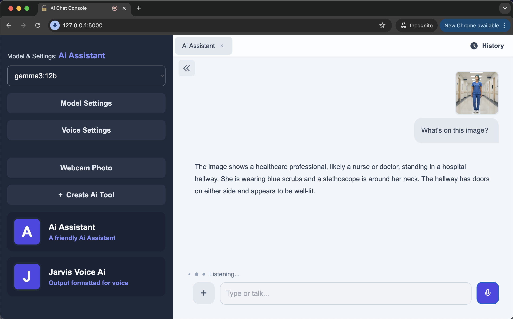
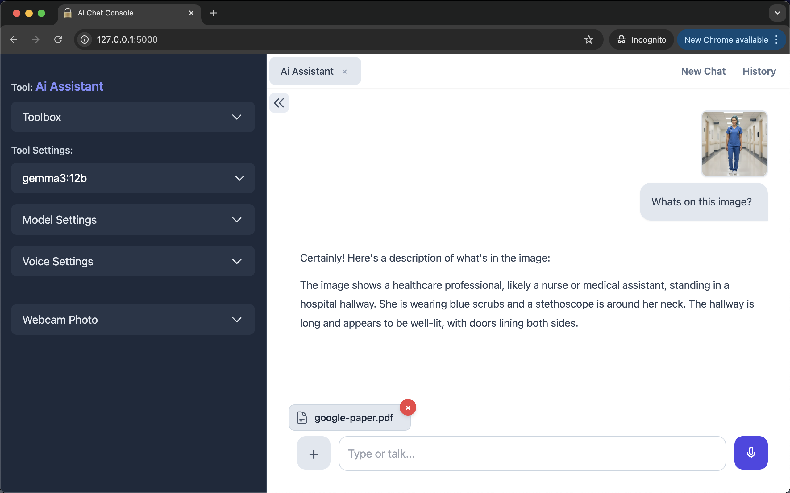
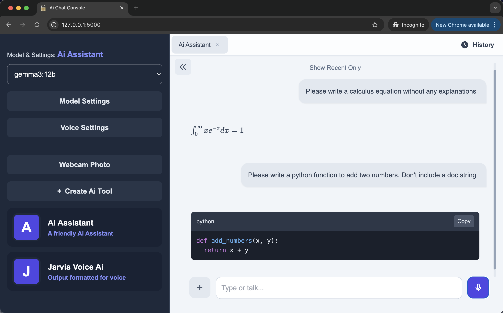

# myOfflineAi - ChatConsole
> 
> Prototype - For testing, education and inspiration

<br>

A transparent, offline-first and privacy-first multimodal Ai console where you can talk, type, show images, adjust parameters and create Ai tools. Uses Flask for the backend, Whisper for Speech-to-Text (STT), Kokoro for Text-to-Speech (TTS), and Ollama for the Large Language Models (LLMs). 

Ideal for privacy concious users and enthusiasts who want to experiment with Ollama Ai models. The single file architecture makes it easy to use Ai to customize the app or to fix bugs. Simply give Gemini 2.5 Pro the app.py file and tell it what new features you want or what bugs you want fixed. 

After the initial setup there's no need to use the command line - simply double click a file to run the app.

The app supports math notation and code rendering making it ideal for use as an tutor or for offline coding practice. There's also a webcam photo feature that allows for homework problems, hand drawn diagrams and other info to be quickly photographed and attached to the chat - just hold the page in front of the webcam and press a button to take a photo.

You can create specialized multimodal Ai tools for summarization, translation, information extraction, and many more uses. Over time you can build up your own toolbox. You can also easily share your tools with others by sending them copies of the agents.json file. They need to put that file into the project folder. When the page loads, the app will automatically load the tools from your agents.json file.


<br>


<p>myOfflineAi App - UI</p>

<br>


<p>myOfflineAi App - Model parameters</p>

<br>


<p>Supports math notation and code rendering</p>

<br>

## How to Install and Run

<br>

In this section you will do the following:
- Install the Ollama desktop app
- Download an Ollama model
- Install the UV Python package manager
- Install ffmeg
- Start the myOfflineAi app by double clicking a file

Notes:<br>
- I tested the installation process on MacOS. Although I've included instructions for Windows, I haven't tested on Windows.
- After setup, you only need to double-click a file to launch the app.

System Requirements:
- Computer: Apple Silicon Mac (M-series) with minimum 16GB RAM - or equivalent
- Free disk space: approx. 10 GB

<br>

```

1. Download and install the Ollama desktop application
--------------------------------------------------------------

This is the link to download Ollama. After downloading, please install it on your computer.
Then launch it. A white chat window will open.
https://ollama.com/

Normally, Ollama will launch automatically when you start your computer.


2. Download an Ollama model
--------------------------------------------------------------

1. Open the Ollama desktop app.
2. Paste the model name (e.g. gemma3:270m) into the dropdown in the bottom right.
3. Type any message e.g. Hi, and press Enter
4. The model will start to auto download.

If you have a fast internet connection then I suggest you download
the gemma3:4b model (3.3GB).
This model can handle both text and images.
If you have a slow connection then download the smaller gemma3:270m model (292MB).
This model can handle text only.


3. Install ffmpeg
--------------------------------------------------------------

# on MacOS using Homebrew (https://brew.sh/)
brew install ffmpeg

# on Windows using Chocolatey (https://chocolatey.org/)
choco install ffmpeg

# on Windows using Scoop (https://scoop.sh/)
scoop install ffmpeg


4. Download the project folder and place it on your desktop
--------------------------------------------------------------

1. On GitHub click on "<> Code". The select "Download Zip"
2. Download the project folder and unzip it.
3. Inside you will find a folder named: myOfflineAi-ChatConsole-v1.0
4. Place myOfflineAi-ChatConsole-v1.0 on your desktop.


5. Initial Setup
--------------------------------------------------------------

[ macOS ]
------------

(Skip steps 1-3 if you have uv already installed.)

1. Open Terminal (Command+Space, type "Terminal")
2. Paste this command into the terminal to install uv:

wget -qO- https://astral.sh/uv/install.sh | sh

3. Wait for uv installation to finish

4. Type 'cd ' in the terminal (with a space after cd)
5. Drag the folder into the Terminal window. A file path will appear.
6. Press Enter
If you get an error, then type in these commands in the terminal to manually cd into myOfflineAi-ChatConsole-v1.0 folder:
cd Desktop
cd myOfflineAi-ChatConsole-v1.0

7. Paste this command into the terminal:

cat start-mac-app.command > temp && mv temp start-mac-app.command && chmod +x start-mac-app.command

8. Press Enter
9. Open the myOfflineAi-ChatConsole-v1.0 folder
10. Double-click: start-mac-app.command


[ Windows ]
------------

(Skip steps 1-6 if you have uv already installed.)

1. Press the Windows key on your keyboard
2. Type cmd and press Enter (a black window will open)
3. Copy this entire command:

powershell -ExecutionPolicy ByPass -c "irm https://astral.sh/uv/install.ps1 | iex"

4. Right-click in the black window to paste
5. Press Enter
6. Wait for "uv installed successfully" or similar message

7. Close the window and open a new one for the changes to take effect
8. Navigate to the myOfflineAi-ChatConsole-v1.0 folder that's on your desktop
9. Double-click: start-windows-app.bat

If Windows shows a security warning:
1. Right-click on start-windows-app.bat 
2. Select "Properties"
3. Check the "Unblock" box at the bottom
4. Click "OK"
5. Now double-click start-windows-app.bat to run


6. Use the app
--------------------------------------------------------------

Type a message. The assistant will respond with both voice and text.
To use voice input: Click the mic icon, then speak.

The name of the model you downloaded will appear in the dropdown menu in the top left.
If you downloaded the gemma3:4b model you can submit images and pdf documents in addition to text.

The app does not stop running when you close the browser tab.
To shut down the app simply close the terminal window.
You can also close the terminal by selecting it and typing Ctrl+C on Mac or Ctrl+C on Windows.

The Ai voice is turned on by default. You can turn it off in Voice Settings.
Any changes you make to the settings will be automatically saved.


7. Future startup
--------------------------------------------------------------

Now that the setup is complete, in future simply Double-click a file to launch the app.
The project folder should be placed on your desktop before the app is launched.

Mac:
start-mac-app.command

Windows:
start-windows-app.bat

You could start the app and leave it running in the background all day.
Then whenever you want to use it, enter the following url in your browser:

http://127.0.0.1:5000/

Your browser will remember this local address so you won't have to.


Quick Troubleshooting
--------------------------------------------------------------
- If the app doesn't start, make sure Ollama is running (look for its icon in your system tray/menu bar)
- If you see "connection refused", restart Ollama
- Make sure you've downloaded at least one model in Ollama before using the app
- For the voice (TTS) to work Kokoro needs two files: kokoro-v1.0.onnx, and voices-v1.0.bin
  These files are auto downloaded during the setup process.
However, if the voice is not working then please download these files manually and place them in the project folder:
kokoro-v1.0.onnx: https://github.com/thewh1teagle/kokoro-onnx/releases/download/model-files-v1.0/kokoro-v1.0.onnx
voices-v1.0.bin: https://github.com/thewh1teagle/kokoro-onnx/releases/download/model-files-v1.0/voices-v1.0.bin


```
<br>

## Detailed writeup

A detailed writeup for a similar project, including trouble-shooting info, is available here:<br>
https://github.com/vbookshelf/myOfflineAi-PrivacyFirst

<br>

## Notes

- When using the voice chat it helps to wear a headset or use earphones with a mic. The voice detection system is quite simple so it won't work well if there's alot of background noise.
- The app streams text before speaking that text out loud. Streaming text has has a latency masking effect - it makes the delay feel shorter than it actually is.
- When setting up a tool (specialized assistant) that uses voice, it helps to tell it (in the system message) not to use markdown - or else the Ai will speak the markdown symbols out loud.
- I found that the gemma3:4b and gemma3:12b models work very well. They are fast, have a high level of intelligence and they can handle both text and images.
- This app uses a single file architecture, meaning that all the code (HTML, CSS, JS and Python) is in one file. Ai can therefore see the entire app logic at once. I highly recommend that you try using Gemini 2.5 Pro to modify the code to add new features or make changes to this app. Simply give the app.py file to Gemini 2.5 Pro (not Flash) and tell it what changes you want. You'll be surprised how well this process works. In the past, if I wanted to build a feature I would have to spend a lot of time researching, watching YouTube videos, doing courses and then trying to fix bugs - now I just sit back and drink coffee while Ai does the work.

<br>

## App Family - Offline-First, Privacy-First, Transparent

- myOfflineAi-PrivacyFirst<br>(Maximum security. No chat history is saved.)<br>
  https://github.com/vbookshelf/myOfflineAi-PrivacyFirst<br>
- myOfflineAi-ChatHistory<br>(Saves chats to a local file you control.)<br>
  https://github.com/vbookshelf/myOfflineAi-ChatHistory<br>
- Chat-Image-Marker<br>(A simple, offline tool for marking up images.)<br>
  https://github.com/vbookshelf/Chat-Image-Marker<br>
- myOfflineAi-VoiceAssistant<br>(An offline full-featured Ai voice assistant.)<br>
  https://github.com/vbookshelf/myOfflineAi-VoiceAssistant<br>
-  myOfflineAi-ChatConsole<br>(Desktop multimodal chat console that supports both text chat and voice chat.)<br>
  https://github.com/vbookshelf/myOfflineAi-ChatConsole

<br>

## Revision History

Version 1.0<br>
17-Oct-2025<br>
Prototype. Released for testing and education.
