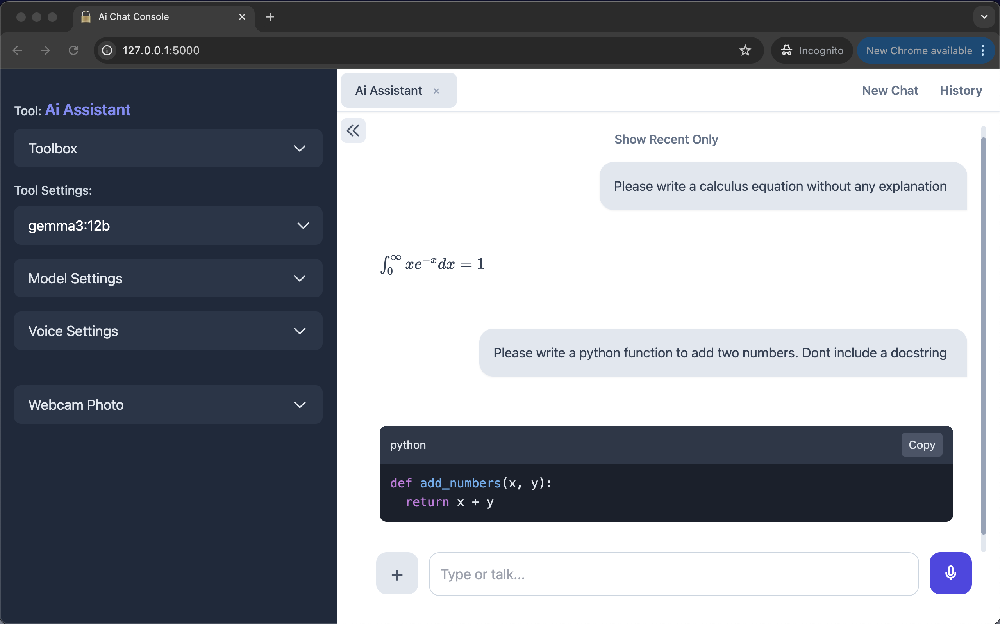

# myOfflineAi - ChatConsole
<strong>A truly offline text and voice Ai chat console</strong>
> 
> Prototype - For testing, education and inspiration

<br>

A transparent, offline-first and privacy-first multimodal Ai console where you can talk, type, show images, adjust parameters and create Ai tools. Uses Flask for the backend, Whisper for Speech-to-Text (STT), Kokoro for Text-to-Speech (TTS), and Ollama for the Large Language Models (LLMs). This is not just a simple chat interface - it's a customizable AI workspace.

<br>

## Key Features

<br>

- <strong>100% Offline and Private:</strong> Your conversations and data never leave your local machine.
- <strong>Multimodal:</strong> Chat using text and images (supports JPG, PNG, WebP, and multi-page PDFs).
- <strong>Voice Chat:</strong> Have a conversation with your Ai.
- <strong>Create Ai Tools:</strong> Create specialized assistants with unique personas, tailored for specific tasks (e.g. code generation, text summarization, creative writing).
- <strong>Advanced Model Controls:</strong> Tune the performance of models with adjustable parameters like temperature, context size, and top_p.
- <strong>Webcam Photos:</strong> Use the webcam to send photos of hand drawn diagrams and homework problems directly to the chat.
- <strong>Chat History:</strong> All conversations are saved in a portable file that can be moved to a secure location or deleted.
- <strong>Supports math notation and code rendering:</strong> Ideal for use as an Ai tutor.
- <strong>Single-file architecture:</strong> Code is easy to audit because HTML, CSS, JS and Python are all in one file. Compliance thinking is built into the design.

<br>

## Key Innovations

<br>

The power of myOfflineAi-ChatConsole comes from its unique combination of existing technologies, applied with a focus on privacy, performance, and accessibility.

- <strong>Self-Contained Single-File Architecture:</strong> The entire application logic is contained in a single file. This design offers two major benefits: it provides a low barrier for tinkering and modification, and more importantly, it makes the codebase easy to audit for security and privacy.
- <strong>"Double-Click to Run" Accessibility:</strong> Through simple .bat (Windows) and .command (macOS) scripts, the application can be launched without needing to use the command line, making it accessible to non-programmers and enthusiasts alike.
- <strong>High-Performance Hybrid Network:</strong> The app intelligently uses both HTTP and WebSockets. HTTP provides robust handling for file uploads, while WebSockets enable a real-time, low-latency connection for streaming AI responses and audio.
- <strong>Instant Audio with Sentence-by-Sentence TTS:</strong> Instead of waiting for the AI to generate its full response, text-to-speech audio begins playing sentence by sentence, creating a much more fluid and natural conversational experience.
- <strong>Ephemeral Data Processing:</strong> Privacy is paramount. User-uploaded images and PDFs are processed entirely in-memory and are never permanently saved to your disk.


<br>


<p>myOfflineAi App - UI</p>

<br>


<p>Model parameters</p>

<br>


<p>Supports math notation and code rendering</p>

<br>

## Who is this for?

<br>

This application is built for professionals, students, and hobbyists — anyone who wants to leverage the power of local LLMs without compromising on privacy or functionality.

- <strong>Students & Lifelong Learners:</strong> A private, 24/7 AI tutor that works completely offline. Get step-by-step homework help, explain complex concepts in everyday language, or analyze textbook pages. It's a powerful learning tool that promotes educational equity by removing the need for a constant internet connection.
- <strong>Developers:</strong> Analyze and debug proprietary code, generate unit tests, and document APIs in a secure, air-gapped environment.
- <strong>Legal & Medical Professionals:</strong> Interrogate sensitive client contracts, case files, or de-identified medical notes with the confidence that confidential data remains local (HIPAA-friendly).
- <strong>Researchers & Academics:</strong> Summarize and analyze research papers, pre-publication data, and literature without risking intellectual property leaks.
- <strong>Ai Experimenters & Hobbyists:</strong> Granular controls for experimenting with multimodal text and voice AI - without API costs. The single-file code setup makes the app easy for Ai to customize - add new features in minutes.

<br>

## How to Install and Run

<br>

In this section you will do the following:
- Install the Ollama desktop app
- Download an Ollama model
- Install the UV Python package manager
- Install ffmeg
- Start the myOfflineAi app by double clicking a file

Notes:<br>
- I tested the installation process on MacOS. Although I've included instructions for Windows, I haven't tested on Windows.
- After setup, you only need to double-click a file to launch the app.

System Requirements:
- Computer: Apple Silicon Mac (M-series) with minimum 16GB RAM - or equivalent
- Free disk space: approx. 10 GB

<br>

```

1. Download and install the Ollama desktop application
--------------------------------------------------------------

This is the link to download Ollama. After downloading, please install it on your computer.
Then launch it. A white chat window will open.
https://ollama.com/

Normally, Ollama will launch automatically when you start your computer.


2. Download an Ollama model
--------------------------------------------------------------

1. Open the Ollama desktop app.
2. Paste the model name (e.g. gemma3:270m) into the dropdown in the bottom right.
3. Type any message e.g. Hi, and press Enter
4. The model will start to auto download.

If you have a fast internet connection then I suggest you download
the gemma3:4b model (3.3GB).
This model can handle both text and images.
If you have a slow connection then download the smaller gemma3:270m model (292MB).
This model can handle text only.


3. Install ffmpeg
--------------------------------------------------------------

# on MacOS using Homebrew (https://brew.sh/)
brew install ffmpeg

# on Windows using Chocolatey (https://chocolatey.org/)
choco install ffmpeg

# on Windows using Scoop (https://scoop.sh/)
scoop install ffmpeg


4. Download the project folder and place it on your desktop
--------------------------------------------------------------

1. On GitHub click on "<> Code". The select "Download Zip"
2. Download the project folder and unzip it.
3. Inside you will find a folder named: myOfflineAi-ChatConsole-v2.0
4. Place myOfflineAi-ChatConsole-v2.0 on your desktop.


5. Initial Setup
--------------------------------------------------------------

[ macOS ]
------------

(Skip steps 1-3 if you have uv already installed.)

1. Open Terminal (Command+Space, type "Terminal")
2. Paste this command into the terminal to install uv:

wget -qO- https://astral.sh/uv/install.sh | sh

3. Wait for uv installation to finish

4. Type 'cd ' in the terminal (with a space after cd)
5. Drag the folder into the Terminal window. A file path will appear.
6. Press Enter
If you get an error, then type in these commands in the terminal to manually cd into myOfflineAi-ChatConsole-v2.0 folder:
cd Desktop
cd myOfflineAi-ChatConsole-v2.0

7. Paste this command into the terminal:

cat start-mac-app.command > temp && mv temp start-mac-app.command && chmod +x start-mac-app.command

8. Press Enter
9. Open the myOfflineAi-ChatConsole-v2.0 folder
10. Double-click: start-mac-app.command


[ Windows ]
------------

(Skip steps 1-6 if you have uv already installed.)

1. Press the Windows key on your keyboard
2. Type cmd and press Enter (a black window will open)
3. Copy this entire command:

powershell -ExecutionPolicy ByPass -c "irm https://astral.sh/uv/install.ps1 | iex"

4. Right-click in the black window to paste
5. Press Enter
6. Wait for "uv installed successfully" or similar message

7. Close the window and open a new one for the changes to take effect
8. Navigate to the myOfflineAi-ChatConsole-v2.0 folder that's on your desktop
9. Double-click: start-windows-app.bat

If Windows shows a security warning:
1. Right-click on start-windows-app.bat 
2. Select "Properties"
3. Check the "Unblock" box at the bottom
4. Click "OK"
5. Now double-click start-windows-app.bat to run


6. Use the app
--------------------------------------------------------------

Type a message. The assistant will respond with both voice and text.
To use voice input: Click the mic icon, then speak.

The name of the model you downloaded will appear in the dropdown menu in the top left.
If you downloaded the gemma3:4b model you can submit images and pdf documents in addition to text.

The app does not stop running when you close the browser tab.
To shut down the app simply close the terminal window.
You can also close the terminal by selecting it and typing Ctrl+C on Mac or Ctrl+C on Windows.

The Ai voice is turned on by default. You can turn it off in Voice Settings.
Any changes you make to the settings will be automatically saved.


7. Future startup
--------------------------------------------------------------

Now that the setup is complete, in future simply Double-click a file to launch the app.
The project folder must be placed on your desktop before the app is launched.

Mac:
start-mac-app.command

Windows:
start-windows-app.bat

You could start the app and leave it running in the background all day.
Then whenever you want to use it, enter the following url in your browser:

http://127.0.0.1:5000/

Your browser will remember this local address so you won't have to.


Quick Troubleshooting
--------------------------------------------------------------
- If the app doesn't start, make sure Ollama is running (look for its icon in your system tray/menu bar)
- If you see "connection refused", restart Ollama
- Make sure you've downloaded at least one model in Ollama before using the app
- For the voice (TTS) to work Kokoro needs two files: kokoro-v1.0.onnx, and voices-v1.0.bin
  These files are auto downloaded during the setup process.
However, if the voice is not working then please download these files manually and place them in the project folder:
kokoro-v1.0.onnx: https://github.com/thewh1teagle/kokoro-onnx/releases/download/model-files-v1.0/kokoro-v1.0.onnx
voices-v1.0.bin: https://github.com/thewh1teagle/kokoro-onnx/releases/download/model-files-v1.0/voices-v1.0.bin


Tips
--------------------------------------------------------------
- When creating agents/tools that will generate math notation, you need to tell the agent to use LaTeX when generating math notation. Please add this note to the system message: Use LaTeX notation for mathematical or scientific expressions only.
- For best results when using your voice - use a headset or earphones with a mic. This reduces background noise. It also allows for a more relaxed chat because you won't have to constantly strain to be clearly heard by the speech to text system.
```
<br>

## Detailed writeup

A detailed writeup for a similar project, including trouble-shooting info, is available here:<br>
https://github.com/vbookshelf/myOfflineAi-PrivacyFirst

<br>

## What Files are Created during operation?

<br>

The application is designed to be self-contained and stores all its configuration and data in the same directory it is run from.
Persistent Configuration and Data Files
These files store your settings and history and remain on your disk between sessions.

1. agents.json<br>
- <strong>Purpose:</strong> This is a crucial file that stores all the custom "AI Tools" (or agents) that you create. It saves their names, titles, system personas, conversation type (single-turn/multi-turn), and any model settings you've specifically configured for them.<br>
- <strong>Lifecycle:</strong> It is automatically created on the first run if it doesn't exist, pre-populated with the default "Ai Assistant." It is read on startup and written to whenever you create, edit, reorder, or delete an AI Tool.

2. conversations.json.<br>
- <strong> Purpose:</strong> This file saves your complete chat history. Each conversation is stored as a separate entry, linked to the specific AI Tool you were using at the time..<br>
- <strong> Lifecycle:</strong> This file is created after your first conversation is completed. It is updated at the end of every chat session to save the new messages.

3. user_settings.json.<br>
- <strong>Purpose:</strong> This file stores your global settings. This includes the default model parameters (temperature, context size, etc.), your voice preferences (language, voice, speed), and other UI-related settings like the PDF page limit. These are the settings that apply to the default "Ai Assistant" and serve as the base for new AI Tools..<br>
- <strong>Lifecycle:</strong> It is created on the first run if it doesn't exist, populated with the application's default values. It is updated any time you change these settings in the sidebar.

3. last_model.txt.<br>
- <strong>Purpose:</strong> A very simple text file that contains only the name of the last Ollama model you selected from the dropdown menu..<br>
- <strong>Lifecycle:</strong> It is created or overwritten every time you select a different model. This ensures the application remembers your preferred model for your next session.

### Temporary Files
This category includes files that are created for a specific, brief task and are deleted automatically.

temp_recording.wav.<br>
- <strong>Purpose:</strong> To temporarily store the raw audio data from your microphone when using the speech-to-text feature..<br>
- <strong>Lifecycle:</strong> This file is ephemeral. It is created the moment you stop speaking, is immediately fed to the Whisper model for transcription, and is then instantly and automatically deleted. It only exists on your disk for a fraction of a second during the transcription process.

### What is Not Saved to Disk
Uploaded Images and PDFs: All user-uploaded files (.jpg, .png, .pdf, etc.) are processed entirely in-memory. They are converted to a Base64 format, sent to the model, and are never written to or saved on your hard drive.

<br>

## Technologies Used

<strong>Backend:</strong> Flask (HTTP), Flask-SocketIO (WebSockets), Ollama<br>
<strong>Frontend:</strong> HTML, Tailwind CSS, JavaScript<br>
<strong>File Processing:</strong> PyMuPDF (for PDFs)<br>
<strong>Speech-to-Text:</strong> OpenAI Whisper<br>
<strong>Text-to-Speech:</strong> Kokoro TTS


<br>

## Notes

- When using the voice chat it helps to wear a headset or use earphones with a mic. The voice detection system is quite simple so it won't work well if there's alot of background noise.
- When setting up a tool (specialized assistant) that uses voice, it helps to tell it (in the system message) not to use markdown - or else the Ai will speak the markdown symbols out loud.
- I found that the gemma3:4b and gemma3:12b models work very well. They are fast, have a high level of intelligence and they can handle both text and images.
- Whisper is an LLM, and it can hallucinate. It sometimes generates random text like "Thank you for watching!". This text then gets converted in to speech.
- Not all parameters are supported by all models. I found that Qwen3 Ollama models would not work if a repeat_penalty parameter was passed to the model. To make the app more robust I've only used parameters that are likely to be supported by the vast majority of models - temperature, context size, top_p.
- Small quantized local models are not yet trustworthy enough to be used for mission critical tasks. They are good for tasks that don't require precise answers like brainstorming and creative writing, or for tasks where a user can quickly check the accuracy of the output.


<br>

## App Family - Offline-First, Privacy-First, Transparent

- myOfflineAi-PrivacyFirst<br>(Maximum security. No chat history is saved.)<br>
  https://github.com/vbookshelf/myOfflineAi-PrivacyFirst<br>
- myOfflineAi-ChatHistory<br>(Saves chats to a local file you control.)<br>
  https://github.com/vbookshelf/myOfflineAi-ChatHistory<br>
- Chat-Image-Marker<br>(A simple, offline tool for marking up images.)<br>
  https://github.com/vbookshelf/Chat-Image-Marker<br>
- myOfflineAi-VoiceAssistant<br>(An offline full-featured Ai voice assistant.)<br>
  https://github.com/vbookshelf/myOfflineAi-VoiceAssistant<br>
-  myOfflineAi-ChatConsole<br>(Desktop multimodal chat console that supports both text chat and voice chat.)<br>
  https://github.com/vbookshelf/myOfflineAi-ChatConsole

<br>

## Revision History

Version 2.0<br>
26-Oct-2025<br>
Implemented a more robust hybrid network architecture - HTTP and WebSockets.<br>
Fixed error with Qwen models.<br>
Removed model parameters that are not supported by all models.

Version 1.1<br>
21-Oct-2025<br>
Enabled flash attention and q_8 context caching to speed up inference.

Version 1.0<br>
17-Oct-2025<br>
Prototype. Released for testing and education.

<br>

