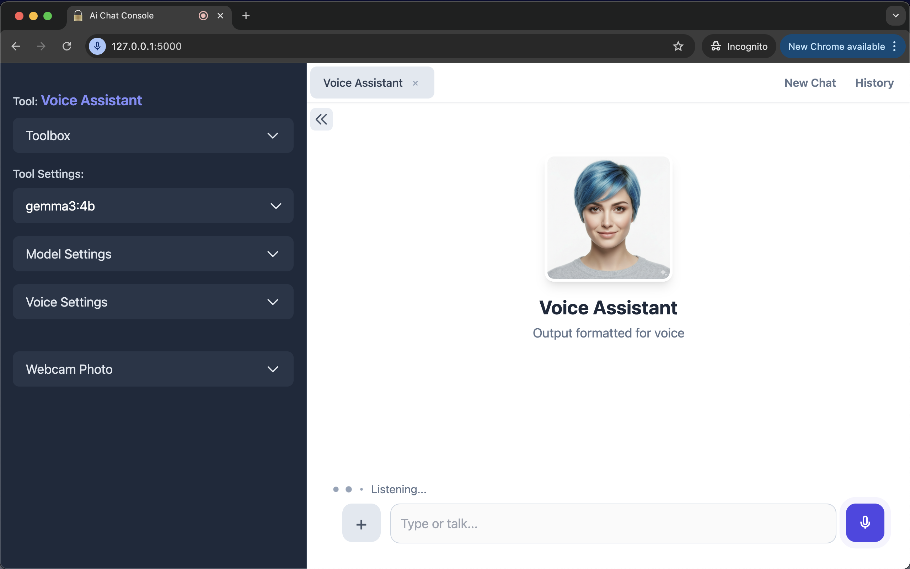

# myOfflineAi - ChatConsole

 

A transparent, offline-first and privacy-first AI console where you can talk, type, show images, adjust parameters and create specialized assistants. Uses Flask for the backend, Whisper for Speech-to-Text (STT), Kokoro for Text-to-Speech (TTS), and Ollama for the Large Language Models (LLMs). Easy to customize using Ai.  Double click to run. Your sensitive data never leaves your machine.

[ Project in progress... ]

 

MyOfflineAi-ChatConsole

